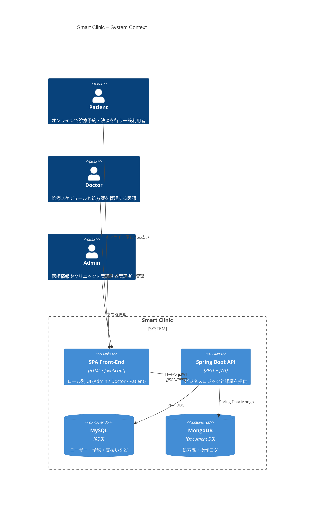

# Smart Clinic – Web-based Clinic Management System

オンライン予約・処方までをワンストップで行える  **小規模クリニック向け OSS** です。

---

## ✨ Features
- 患者（PATIENT） / 医師（DOCTOR） / 管理者（ADMIN）の 3 ロール UI
- ロール別のダッシュボード画面
- JWT 認証 & RBAC
- MySQL + MongoDB の Polyglot Persistence
- コンテナ 1 コマンド (`docker compose up -d`) で起動

## 🚀 Quick Start

```bash
# 1. Clone
git clone https://github.com/your-org/SmartClinic.git
cd SmartClinic

# 2. Build & Run (API + MySQL + MongoDB)
docker compose up -d --build

# 3. Access
#  - Frontend : http://localhost:8080/
#  - Swagger  : http://localhost:8080/swagger-ui/index.html

# 4. 初期データ(デモ用)・・・起動時に自動でInsertされるように設定しております。
#  - Adminユーザ（ユーザ名：adminUser1、PW：addpass1）
#  - Doctorユーザ（ユーザ名：doctorUser1、PW：docpass1）

```
---
## 🐬 システム概要図


---
## 🔥 バックエンド構成図
```mermaid
flowchart TD
    %%──────────────────────────────────────
    %%  Sub-graph : API
    %%──────────────────────────────────────
    subgraph SPRING_BOOT_API["Spring Boot API"]
        direction TB
        controller["REST Controller<br/><span style='font-size:11px'>Spring MVC</span>"]
        security["Security Filter<br/><span style='font-size:11px'>JWT / RBAC</span>"]
        service["Service Layer<br/><span style='font-size:11px'>Business Logic</span>"]
        repoJpa["JPA Repository<br/><span style='font-size:11px'>Spring Data JPA</span>"]
        repoMongo["Mongo Repository<br/><span style='font-size:11px'>Spring Data Mongo</span>"]
    end

    %%──────────────────────────────────────
    %%  Datastores
    %%──────────────────────────────────────
    mysql["MySQL<br/><span style='font-size:11px'>users / admins / patients / doctors / clinic_locations / doctor_available_times / appointments / payments</span>"]
    mongo["MongoDB<br/><span style='font-size:11px'>prescriptions / audit logs</span>"]

    %%──────────────────────────────────────
    %%  Relations（内部）
    %%──────────────────────────────────────
    controller -->|calls| service
    security -- filters --> controller
    security -- "・token認証しROLE取得
                ・POST /api/auth/loginでJWT発行
    （jwtAuthFilter, UserDetailsService,　jwtService）
        ⇒　SecurityContextに認証情報をセット" --> service

    service --> repoJpa
    service --> repoMongo

    repoJpa -->|JDBC| mysql
    repoMongo -->|Driver| mongo


