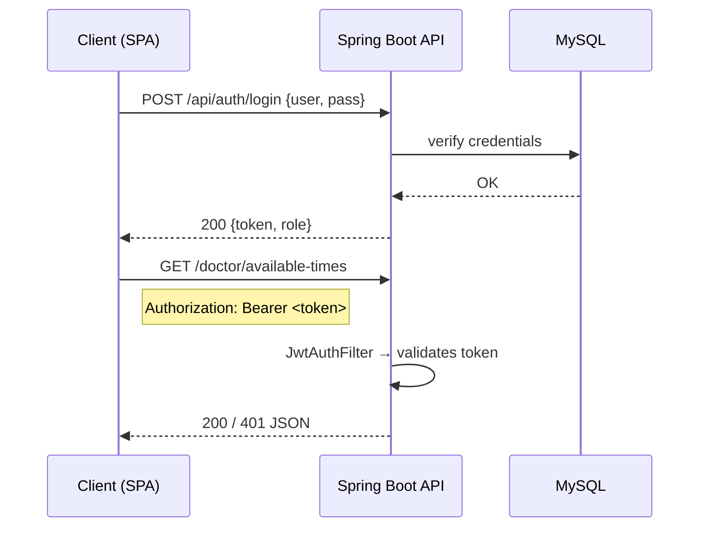
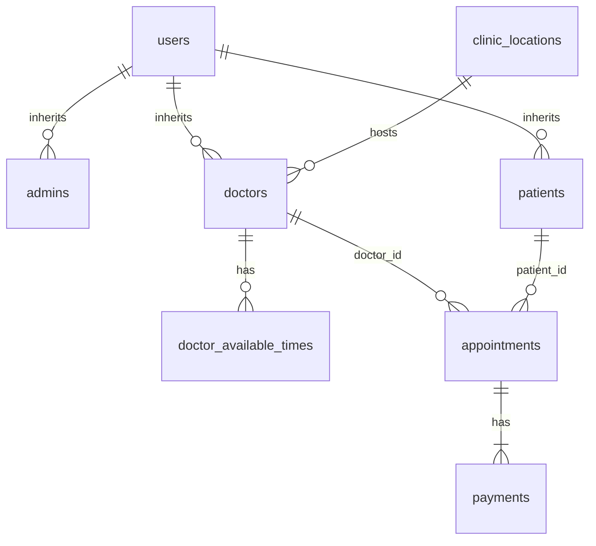

# **Smart Clinic – Backend Design Document**
*Version 1.0 – June 2025*

---

## Table of Contents
1. [System Overview](#system-overview)  
2. [Technology Stack](#technology-stack)  
3. [Security & Authentication](#security--authentication)  
4. [Database Schema](#database-schema)  
5. [REST API Reference](#rest-api-reference)  
6. [Error Handling Strategy](#error-handling-strategy)  
7. [Future Enhancements](#future-enhancements)

---

## System Overview
Smart Clinic is a full‑stack appointment platform for small to mid‑size medical practices.  
The backend provides:

* JWT‑secured multi‑tenant REST API
* Role‑based access (Admin / Doctor / Patient)
* Doctor availability management
* Appointment, payment & prescription workflows
* Swagger/OpenAPI 3.1 self‑documentation

---

## Technology Stack
| Layer | Tech | Notes |
|-------|------|-------|
| Language | **Java 17** | Modern LTS build |
| Framework | **Spring Boot 3.2** | REST, DI, validation |
| Security | **Spring Security 6** + JWT | Stateless, roles via `@PreAuthorize` |
| Database | **MySQL 8** | Relational store (clinic core) |
| NoSQL | **MongoDB 6** | High‑volume prescriptions |
| ORM | **Hibernate 6** (JPA) | Lazy fetch tuned, batch fetch |
| API Docs | **springdoc‑openapi** | Swagger UI auto‑generated |
| Build | **Maven** | Multi‑module layout |
| CI/CD | GitHub Actions → Flyway → AWS Elastic Beanstalk |

---

## Security & Authentication
### JWT Flow

* **Expiration:** 24 h, renewable  
* **Claims:** `sub` (username), `role`, optional `userId` (future)  
* **Custom EntryPoint:** uniform `401` JSON:  
  ```json
  { "error": 401, "message": "Invalid or expired token." }
  ```

### Role Matrix
| Endpoint prefix | Admin | Doctor | Patient |
|-----------------|:----:|:------:|:-------:|
| `/api/auth/**`  | ✅ | ✅ | ✅ |
| `/doctor/**`    | ⚙️ CRUD | ✅ self | 🔍 read |
| `/appointments` | – | 🗓 read | 🗓 CRUD |
| `/prescription` | – | 💊 CRUD | – |

---

## Database Schema
### Relational Tables
| Table | Columns (PK **bold**) | Purpose |
|-------|-----------------------|---------|
| **users** | **id**, username, password_hash, full_name, role, created_at | Root identity |
| admins | **id** (FK→users) | Marker |
| doctors | **id** (FK→users), specialty, phone, clinic_location_id | Domain entity |
| doctor_available_times | **doctor_id**, **available_times** (PK composite) | Flat time slots |
| patients | **id** (FK→users), address, phone, date_of_birth, gender | Domain entity |
| appointments | **id**, doctor_id, patient_id, appointment_time, status | Booking |
| payments | **id**, appointment_id, method, status | Optional |
| clinic_locations | **id**, name, address, phone | Reference |


### Mongo Collection `prescriptions`
```json
{
  "_id": "665c0e5b734b0d226e24a1e3",
  "patientId": "12",
  "appointmentId": 58,
  "medication": "Aspirin",
  "dosage": "100 mg",
  "doctorNotes": "Take once after breakfast"
}
```

---

## REST API Reference
> **Base URL:** `/api`

### Auth
| Method | Path | Body | Success (200) | Notes |
|--------|------|------|---------------|-------|
| `POST` | `/auth/login` | `{username,password}` | `{token,role}` | Public |

### Doctor Core
| Method | Path | Role | Payload | Response |
|--------|------|------|---------|----------|
| `GET`  | `/doctor` | Patient | – | `{doctors:[...]}` |
| `GET`  | `/doctor/availability/{doctorId}/{date}` | Patient/Doctor | – | `{availableTimes:[...]}` |
| `POST` | `/doctor` | Admin | Doctor JSON | `201` `{message}` |
| `PUT`  | `/doctor` | Admin | Doctor JSON | `200` |
| `DELETE`| `/doctor/{doctorId}` | Admin | – | `200` |

### Doctor ► Self Availability
| Method | Path | Body | 200 JSON |
|--------|------|------|----------|
| `GET` | `/doctor/available-times` | – | `{availableTimes:[...]}` |
| `POST` | `/doctor/available-times` | `{time}` | `{message}` |
| `PUT` | `/doctor/available-times` | `{oldTime,newTime}` | `{message}` |
| `DELETE` | `/doctor/available-times` | `{time}` | `{message}` |

### Appointment
| Method | Path | Role | Description |
|--------|------|------|-------------|
| `POST` | `/appointments` | Patient | Create w/ payment |
| `PUT` | `/appointments` | Patient | Reschedule |
| `GET` | `/appointments/{doctorId}/{date}` | Doctor | Daily list |
| `GET` | `/appointments/{doctorId}/{date}/{patientName}` | Doctor | Filtered |

*(See Swagger UI at `/swagger-ui/index.html` for exhaustive models and samples.)*

---

## Error Handling Strategy
* **400** – Validation / domain errors (e.g. duplicate availability)  
* **401** – Missing / invalid JWT (`CustomAuthenticationEntryPoint`)  
* **403** – Role mismatch (handled by Spring Security)  
* **404** – Not found (repositories & services)  
* **5xx** – Uncaught runtime exceptions → global `@ControllerAdvice`

---

## Future Enhancements
* Refresh tokens & silent re‑auth  
* Kafka event stream for analytics  
* AWS SES mailer for appointment reminders  
* FHIR‑compliant API façade (HL7)  
* Multi‑clinic SaaS tiering & billing

---

> © 2025 Smart Clinic – All rights reserved.  
> _Crafted with Spring Boot and a sprinkle of AI ✨_
