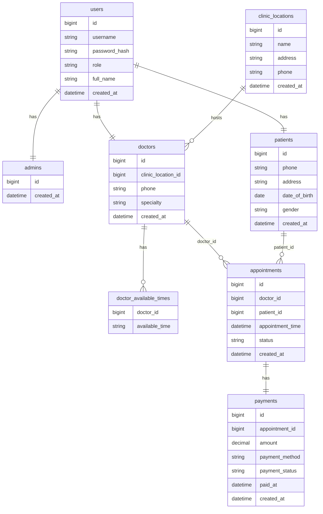

## MySQL Database Design
# スマートクリニック管理システム - データベース設計書（NOT NULL 指定付き）

本設計書では、MySQL データベースの各テーブルに NOT NULL 制約を明示しています。  
NOT NULL によって「必須入力項目」を定義し、データの整合性を強化します。

---

## 💾 MySQL テーブル定義（NOT NULL 明示）

### 🧑 Table: users（ユーザー共通情報）

| カラム名       | データ型                            | 制約                               | 説明                             |
|----------------|-----------------------------------|----------------------------------|----------------------------------|
| id             | BIGINT, PRIMARY KEY                | NOT NULL, AUTO_INCREMENT         | 主キー：ユーザーID（Admin, Doctor, Patient共通）  |
| username       | VARCHAR(50)                       | NOT NULL, UNIQUE, MAX_LENGTH(50) | ユーザー名（ログイン時に使用）   |
| password_hash  | VARCHAR(255)                     | NOT NULL                        | パスワードのハッシュ値（JSON出力不可）           |
| role           | ENUM('ADMIN', 'DOCTOR', 'PATIENT')| NOT NULL                       | ユーザーのロール                 |
| created_at     | DATETIME                         | NOT NULL, DEFAULT CURRENT_TIMESTAMP, 更新不可 | アカウント作成日時               |

---  

### 🛠️ Table: admins（管理者情報）

| カラム名       | データ型                            | 制約                          | 説明                                               |
|----------------|-----------------------------------|-------------------------------|----------------------------------------------------|
| id             | BIGINT                            | PRIMARY KEY, NOT NULL          | 管理者ID。usersテーブルの主キーと同じ値を共有。   |
| created_at     | DATETIME                         | NOT NULL, 更新不可             | 登録日時。初回登録時に現在日時をセット。           |

---

### 🥶 Table: patients（患者情報）

| カラム名       | データ型                            | 制約                        | 説明                             |
|----------------|-----------------------------------|-----------------------------|----------------------------------|
| id             | BIGINT, PRIMARY KEY                | NOT NULL                    | 主キー：患者ID（UserエンティティのIDと一致）                   |
| phone          | VARCHAR(13)                      | NOT NULL, REGEXP(`^\d{3}-\d{4}-\d{4}$`)  | 電話番号（ハイフンあり形式、例：080-1234-5678）          |
| address        | VARCHAR(255)                      | NOT NULL, MAX_LENGTH(255)   | 住所（最大255文字）             |
| date_of_birth  | DATE                              | NOT NULL                    | 生年月日                         |
| gender         | ENUM('male', 'female', 'other')   | NOT NULL                    | 性別                             |
| created_at     | DATETIME DEFAULT CURRENT_TIMESTAMP | NOT NULL                    | 登録日時（作成時に自動生成）            |


※ `name`, `email`, `password` などの基本情報は `User` テーブルに持たせ、`Patient` テーブルは患者固有の情報を管理しています。

---

### 💊 Table: doctors（医師情報）

| カラム名       | データ型               | 制約                      | 説明                              |
|----------------|------------------------|---------------------------|-----------------------------------|
| id             | BIGINT, PRIMARY KEY     | NOT NULL                  | 主キー：医師ID（UserのIDと一致） |
| clinic_location_id      | INT            | NOT NULL, 外部キー        |  clinic_locations.idを参照                      |
| specialty      | VARCHAR(50)            | NOT NULL                  | 専門分野                         |
| phone          | VARCHAR(13)                      | NOT NULL, REGEXP(`^\d{3}-\d{4}-\d{4}$`)  | 電話番号（ハイフンあり形式、例：080-1234-5678）          |
| created_at     | DATETIME               | NOT NULL, 更新不可        | 登録日時（Java側で自動生成）                        |

---

### ⏰ Table: doctor_available_times（診療可能時間帯）
※Javaエンティティで@ElementCollectionした場合

| カラム名       | データ型               | 制約                      | 説明                              |
|----------------|------------------------|---------------------------|-----------------------------------|
| doctor_id      | BIGINT                 | NOT NULL, 外部キー         | doctors.idを参照                  |
| available_time | VARCHAR(20)            | NOT NULL                  | 診療可能時間帯（例："09:00-10:00"）|

---

### 🏥 Table: clinic_locations（クリニック所在地）

| カラム名    | データ型                            | 制約                   | 説明                       |
|-------------|-----------------------------------|------------------------|----------------------------|
| id          | INT, PRIMARY KEY, AUTO_INCREMENT  | NOT NULL               | 主キー：所在地ID           |
| name        | VARCHAR(100)                      | NOT NULL               | クリニック名               |
| address     | VARCHAR(255)                      | NOT NULL               | 所在地住所                 |
| phone          | VARCHAR(13)                      | NOT NULL, REGEXP(`^\d{3}-\d{4}-\d{4}$`)  | 電話番号（ハイフンあり形式、例：080-1234-5678）          |
| created_at  | DATETIME DEFAULT CURRENT_TIMESTAMP | NOT NULL               | 登録日時                   |

---

### 💳 Table: payments（支払い情報）

| カラム名         | データ型                            | 制約                                                   | 説明                       |
|------------------|-----------------------------------|--------------------------------------------------------|----------------------------|
| id               | INT, PRIMARY KEY, AUTO_INCREMENT  | NOT NULL                                               | 主キー：支払いID           |
| appointment_id   | INT                               | NOT NULL, FOREIGN KEY → appointments(id)               | 外部キー：予約ID           |
| amount           | DECIMAL(10,2)                     | NOT NULL                                               | 支払い金額                 |
| payment_method   | ENUM('cash', 'credit', 'insurance') | NOT NULL                                             | 支払い方法                 |
| payment_status   | ENUM('Paid', 'Pending', 'Failed') | NOT NULL                                               | 支払いステータス           |
| paid_at          | DATETIME                         | NULL（未払いの場合NULL）                               | 支払日時（支払済のみ）     |
| created_at       | DATETIME DEFAULT CURRENT_TIMESTAMP | NOT NULL                                             | レコード作成日時           |

---

### 📅 Table: appointments（予約情報）

| カラム名            | データ型                            | 制約                                                   | 説明                                     |
|---------------------|-----------------------------------|--------------------------------------------------------|------------------------------------------|
| id                  | BIGINT, PRIMARY KEY, AUTO_INCREMENT | NOT NULL                                               | 主キー：予約ID                           |
| patient_id          | BIGINT                            | NOT NULL, FOREIGN KEY → patients(id)                   | 外部キー：患者ID                         |
| doctor_id           | BIGINT                            | NOT NULL, FOREIGN KEY → doctors(id)                    | 外部キー：医師ID                         |
| appointment_time    | DATETIME                          | NOT NULL, アプリ側で未来日時バリデーション             | 予約日時                                 |
| status              | INT                               | NOT NULL, 0=Scheduled, 1=Completed, 2=Cancelled         | 予約ステータス（整数で管理）            |

---


### ⚠️ 備考

- `id` は `users` テーブルの `id` と1対1で対応しており、外部キー制約 `fk_admin_user` が設定されています。  
- `users.id` が削除されると連動して `admins` の該当レコードも削除されます（`ON DELETE CASCADE`）。  
- 管理者の権限や認証情報（ユーザー名・パスワード等）は `User` エンティティで管理されます。  
- 管理者ごとの拡張情報はこのテーブルに追加可能です。


---

## ✅ 補足事項

- **必須入力項目**：NOT NULL を設定することで、アプリケーションやユーザーの入力ミスを防止。  
- **外部キー制約**：appointments.patient_id や doctor_id は参照整合性を担保。  
- **ユニーク制約**：メールアドレスやユーザー名は一意に保つ。  
- **notes や paid_at のような任意項目は NULL を許容**。  

---


## 📦 MongoDB 利用概要

MongoDB は、柔軟なスキーマ設計が求められるデータを格納するために使用します。  
特に以下のようなデータを想定しています。

- **prescriptions（処方箋）**  
- **feedbacks（患者・医師のフィードバック）**  
- **logs（システムログや操作履歴）**

---

### 💊 Collection: prescriptions（処方箋）

```json
{
  "_id": "ObjectId('64abc123456')",            // MongoDB固有のドキュメントID
  "patientId": "101",                            // MySQLのpatients.idと紐づく数値ID
  "appointmentId": 51,                         // MySQLのappointments.idと紐づく数値ID
  "medication": "パラセタモール",
  "dosage": "500mg",
  "doctorNotes": "6時間おきに1錠服用してください。",
}

```

### 💊 Collection: feedbacks（フィードバック）

```json
{
  "_id": "ObjectId('64def456789')",
  "patientId": 101,                           // MySQLのpatients.id
  "clinicId": 301,                            // MySQLのclinics.id に対応
  "rating": 4,                                // 総合評価（1〜5）
  "comments": "受付から診察までスムーズでした。",
  "createdAt": "2025-06-01T10:00:00Z"         // フィードバック作成日時 (ISO8601形式)
}

```

### 💊 Collection: logs（システムログ）

## 患者が自ら予約操作した場合のログ例
ログ内の `performedBy.userId` と `patientId` が同一で `role: "patient"` の場合、その予約操作は「患者本人によるもの」であると判断します。
```json
{
  "_id": "ObjectId('64fed321654')",
  "patientId": 101,                   // 対象：患者本人
  "performedBy": {
    "userId": 101,                    // 操作したユーザー（患者自身）
    "role": "patient"
  },
  "action": "予約を作成しました",
  "timestamp": "2025-06-01T09:30:00Z",
  "details": {
    "appointmentId": 51,
    "status": "Scheduled"
  }
}

```

## 管理者が患者の予約を代理作成した場合のログ例
```json
{
  "_id": "ObjectId('64fed321655')",
  "patientId": 101,                   // 対象：患者
  "performedBy": {
    "userId": 301,                    // 操作：管理者ID
    "role": "admin"
  },
  "action": "予約を代理作成しました",
  "timestamp": "2025-06-01T10:00:00Z",
  "details": {
    "appointmentId": 52,
    "status": "Scheduled"            //　※ logs.details.status は `appointments.status` と同じ ENUM('Scheduled', 'Completed', 'Cancelled') を使用。
  }
}


```

### Entity Relationship Diagram


